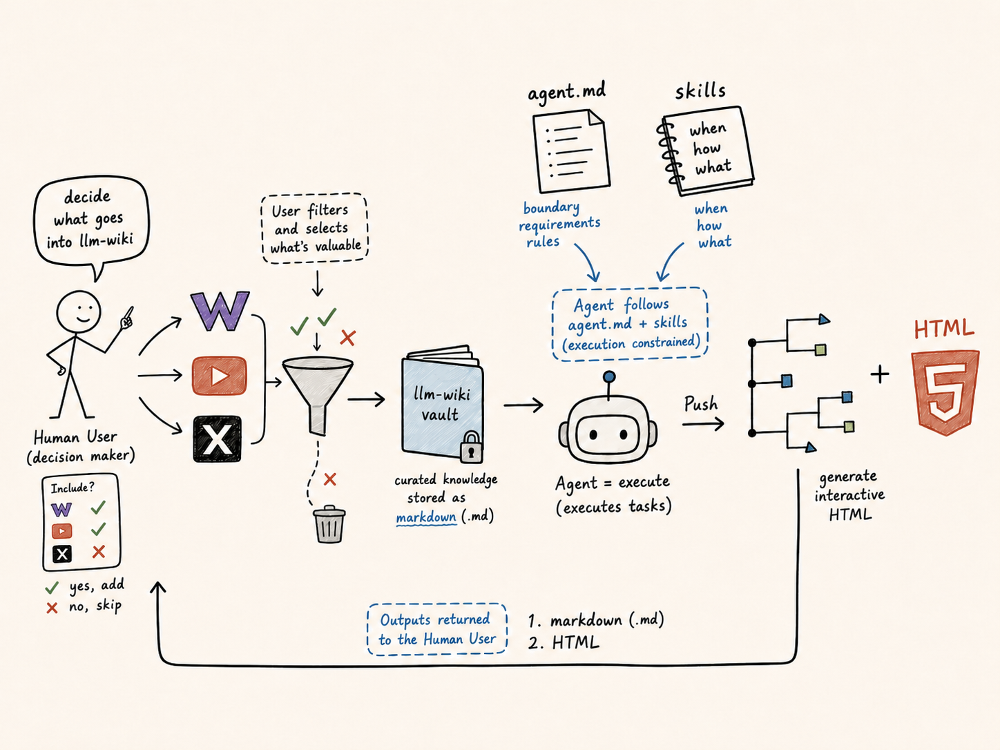

# Agentic Knowledge Vault: A Portable Information Structure for Human-AI Knowledge Work

This repository is a sanitized public demonstration of a portable Markdown knowledge vault. It shows how raw notes — classroom discussions, video transcripts, and web articles — can be transformed into structured notes that are readable in GitHub, useful in Obsidian, and easier for AI agents to search, interpret, and maintain.



## Information Story

Raw information often starts as scattered material: class discussion notes, a YouTube transcript, a saved web article. It is useful, but long, inconsistent, and hard to reuse. This vault converts raw notes into structured Markdown files with YAML frontmatter, source paths, topic indexes, and links between related concepts.

The human role is judgment: deciding what belongs in the vault, what should stay private, which ideas matter, and whether a processed note is faithful to its source. The agent role is execution under explicit project rules: formatting notes, adding metadata, linking related pages, updating indexes, preserving provenance, and checking for broken references.

The result is a small, portable information structure: raw evidence remains available, processed notes explain the meaning, and metadata/indexes help both people and agents navigate the material without rereading everything.

## Problem This Project Solves

Notes are often scattered across class documents, discussion posts, screenshots, files, and local folders. They may be meaningful to the person who wrote them but difficult for another person or an AI tool to reuse later.

AI tools work better when context is structured. A Markdown vault with clear folders, YAML metadata, stable filenames, indexes, and source traces gives agents a reliable way to retrieve information while keeping the project understandable to human readers.

## Project Structure

Top-level folders use numbered prefixes so they sort in reading order: raw input first (`00_Raw`), processed knowledge next (`01_Wiki`), and navigation/governance metadata last (`02_Meta`). Internal references use these numbered names.

```text
agentic-knowledge-vault/
├── 00_Raw/                         # Original source layer (immutable)
│   ├── Inbox/
│   │   └── Class Notes/
│   │       └── Portable Information Structure - class discussion.md
│   ├── Sources/                    # Stable external captures, by source type
│   │   ├── YouTube/
│   │   │   └── Prompting 101 Code w Claude.md
│   │   ├── Web_Posts/
│   │   │   └── Thariq - ... - The Unreasonable Effectiveness of HTML.md
│   │   ├── Articles/  Papers/  Social_Posts/  Videos/
│   └── Assets/                     # Images, PDFs, Screenshots
├── 01_Wiki/                        # Processed knowledge layer
│   ├── Concepts/
│   ├── Projects/
│   │   └── Class Notes/
│   ├── Questions/
│   └── Source_Notes/
├── 02_Meta/                        # Navigation and governance layer
│   ├── index.md
│   ├── topic_index.md
│   ├── vault_manifest.json
│   ├── metadata_schema.md
│   ├── log.md
│   └── templates/
├── AGENTS.md
├── LICENSE
└── README.md
```

## FAIR Principles

This project applies FAIR in a lightweight way rather than as a heavy research-data infrastructure.

- **Findable:** Notes use meaningful filenames, frontmatter titles, aliases, tags, summaries, topic indexes, and a machine-readable manifest.
- **Accessible:** The vault is plain Markdown and JSON, readable in GitHub, Obsidian, terminal tools, and AI-agent workflows.
- **Interoperable:** Notes use Markdown links, Obsidian wikilinks, YAML frontmatter, ISO dates, controlled note types, and consistent metadata fields.
- **Reusable:** Processed notes preserve source paths, summaries, provenance, related notes, and reusable templates so future users can extend the structure.

## How To Use This Project

This walkthrough uses two real sources already in the vault as worked examples:

- A YouTube transcript: [`00_Raw/Sources/YouTube/Prompting 101 Code w Claude.md`](00_Raw/Sources/YouTube/Prompting%20101%20Code%20w%20Claude.md)
- A web article: [`00_Raw/Sources/Web_Posts/Thariq - Using Claude Code - The Unreasonable Effectiveness of HTML.md`](00_Raw/Sources/Web_Posts/Thariq%20-%20Using%20Claude%20Code%20-%20The%20Unreasonable%20Effectiveness%20of%20HTML.md)

### 1. Browse in GitHub

Start with [`02_Meta/index.md`](02_Meta/index.md) for a high-level map of every raw source and processed note. To see the raw-to-processed transformation, open one of the raw files above and compare it with its processed notes under `01_Wiki/`.

### 2. Open in Obsidian

Clone or download the repository, then choose this folder as an Obsidian vault. Obsidian recognizes the Markdown files and resolves the `[[wikilinks]]` between notes without a custom plugin. Wikilinks resolve by note title, so they keep working even when folders are renamed.

### 3. Add a new raw note

Place new unprocessed material under the matching `00_Raw/` subfolder, and do not edit it afterward — the raw layer is your evidence and provenance.

- The video transcript was captured verbatim into `00_Raw/Sources/YouTube/`.
- The X article was captured into `00_Raw/Sources/Web_Posts/`.
- Personal, not-yet-processed notes go under `00_Raw/Inbox/` (for example `00_Raw/Inbox/Class Notes/`); attachments go under `00_Raw/Assets/`.

### 4. Process a note into structured Markdown

For each raw source, create processed notes under `01_Wiki/` using the templates in `02_Meta/templates/`. A good pattern is one **source note** (a faithful summary that routes into other notes) plus any reusable **concept notes** you can extract. Both new sources were processed this way:

| Raw source | Source note (`01_Wiki/Source_Notes/`) | Extracted concept (`01_Wiki/Concepts/`) |
| --- | --- | --- |
| Prompting 101 (YouTube) | [Prompting 101 - Code with Claude](01_Wiki/Source_Notes/Prompting%20101%20-%20Code%20with%20Claude.md) | [Prompt Engineering Structure](01_Wiki/Concepts/Prompt%20Engineering%20Structure.md) |
| Thariq on HTML (web) | [Thariq - The Unreasonable Effectiveness of HTML](01_Wiki/Source_Notes/Thariq%20-%20The%20Unreasonable%20Effectiveness%20of%20HTML.md) | [HTML as an Agent Output Format](01_Wiki/Concepts/HTML%20as%20an%20Agent%20Output%20Format.md) |

When processing, each note should:

- carry FAIR-lite YAML frontmatter (see [`02_Meta/metadata_schema.md`](02_Meta/metadata_schema.md));
- keep `source_paths` pointed at the exact raw file, so provenance is never lost;
- summarize without erasing important context, and mark `confidence` when synthesis is uncertain;
- link related notes with `[[wikilinks]]`, including into notes that already exist. For example, the HTML concept links back into the existing [FAIR Principles for Agentic Knowledge Bases](01_Wiki/Concepts/FAIR%20Principles%20for%20Agentic%20Knowledge%20Bases.md) note, which already discussed the Markdown-versus-HTML trade-off.

### 5. Maintain indexes and metadata

After adding processed notes, register them so an agent can route to them before reading full notes:

- add a one-line entry to [`02_Meta/index.md`](02_Meta/index.md) under the right category;
- add the note to the relevant topic clusters in [`02_Meta/topic_index.md`](02_Meta/topic_index.md);
- add a routing entry to [`02_Meta/vault_manifest.json`](02_Meta/vault_manifest.json) (path, type, status, tags, summary, source paths, related);
- record the change in [`02_Meta/log.md`](02_Meta/log.md).

Keep these files lightweight — they are routing tools, not copies of the note content.

### 6. Use with an AI agent

Use [`AGENTS.md`](AGENTS.md) as the project-level system prompt for an AI agent working in this vault. It tells the agent how to preserve raw sources, create structured notes, maintain metadata and indexes, and run safety checks. A typical request is: *"Read `02_Meta/index.md`, `02_Meta/topic_index.md`, and `02_Meta/vault_manifest.json` first, then process the new transcript in `00_Raw/Sources/YouTube/` into a source note and any concept notes, and update the indexes."* That is exactly the workflow used to produce the four processed notes above.

## Public Release Notes

This public repository is a sanitized demonstration version. It includes three raw sources (one class-discussion note, one YouTube transcript, and one web article), their directly related processed notes, project metadata, templates, and the information-story image. Empty source and asset folders are kept as placeholders to show the intended information architecture for future users. Unrelated private notes, personal materials, raw web captures, local configuration, caches, credentials, and Git history from the private vault are intentionally excluded.

## License

This project is released under the Creative Commons Attribution 4.0 International License. See `LICENSE` for details.
